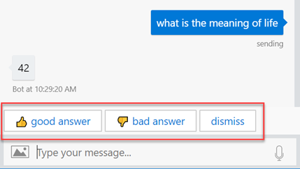

# Feedback Collection Middleware for Microsoft Bot Framework

This directory contains sample code that can be used to build a feedback-request mechanism for your bot. For example, a question-and-answer (QnA) bot may choose to prompt users to rate the quality of answers.

When combined with the [TranscriptLogger](https://github.com/Microsoft/botbuilder-js/blob/master/libraries/botbuilder-core/src/transcriptLogger.ts) middleware and an appropriate transcript store (e.g. [Cosmos DB](../botbuilder-transcript-cosmosdb) or [Application Insights](../botbuilder-transcript-app-insights)) this tool can help drive quality-assurance (QA) analytics reporting.

## Prerequisites

- A NodeJS bot using [Bot Framework v4](https://docs.microsoft.com/en-us/azure/bot-service/?view=azure-bot-service-4.0)
- Your bot should be configured for [ConversationState](https://docs.microsoft.com/en-us/azure/bot-service/bot-builder-howto-v4-state?view=azure-bot-service-4.0&tabs=js)
- For optimal use, your bot should be configured to store transcript logs to an analytics database like [Cosmos DB](../botbuilder-transcript-cosmosdb) or [Application Insights](../botbuilder-transcript-app-insights)

## Install

Because this package is supplied as sample code, it is not available on npm and it comes with no guarantee of support or updates. To use this software in your own app:

1. clone this repo
2. `cd botbuilder-utils-js/packages/botbuilder-feedback`
3. `npm install`
4. `cd {your-app}`
5. `npm install file:path-to-botbuilder-utils-js/packages/botbuilder-feedback`
6. _Recommended_: follow install steps for either [botbuilder-transcript-cosmosdb](../botbuilder-transcript-cosmosdb) or [botbuilder-transcript-app-insights](../botbuilder-transcript-app-insights) so that you can query feedback results.

> To support CI and other automation tasks, you may also choose to publish this package on a private npm repo, or simply copy the code/dependencies into your own app.

## Usage

> JavaScript example is shown below, but this package also works great in TypeScript projects.

```JavaScript
const {
  ActivityTypes, AutoSaveStateMiddleware, BotFrameworkAdapter, ConsoleTranscriptLogger,
  ConversationState, MemoryStorage, TranscriptLoggerMiddleware } = require('botbuilder');
const { Feedback } = require('botbuilder-feedback');

// configure middleware
const logstore = new ConsoleTranscriptLogger(); // upgrade this to a persistent store like Cosmos DB or Appplication Insights
const stateStorage = new MemoryStorage(); // only use MemoryStorage in dev
const conversationState = new ConversationState(stateStorage);
const autoSaveState = new AutoSaveStateMiddleware(conversationState);
const feedback = new Feedback(conversationState);
const logger = new TranscriptLoggerMiddleware(logstore);

// create the bot
const adapter = new BotFrameworkAdapter({
    appId: process.env.MICROSOFT_APP_ID,
    appPassword: process.env.MICROSOFT_APP_PASSWORD,
  }).use(logger, autoSaveState, feedback);

// call for feedback in your bot logic
const logic = async (context) => {
  if (context.activity.type === ActivityTypes.Message) {
      if (context.activity.text.toLowerCase().startsWith('what is the meaning of life')) {
        await Feedback.sendFeedbackActivity(context, '42');
      } else {
        await context.sendActivity(`You said '${context.activity.text}'`);
      }
    }
};

/* adapter.processActivity(...) implementation omitted */
```

When `Feedback.sendFeedbackActivity(...)` is invoked, a message is automaticaly sent to the user showing feedback choices with the answer:



_The user may click or type their response. If anything other than the available options is typed, the feedback is considered ignored_

## API

### Feedback (class)

```TypeScript
constructor(conversationState: ConversationState, options?: FeedbackOptions)
```

* `conversationState`: The instance of [`ConversationState`](https://docs.microsoft.com/en-us/azure/bot-service/bot-builder-howto-v4-state?view=azure-bot-service-4.0&tabs=js) used by your bot
* `options`: Optional configuration to override default prompts and behavior
* `options.feedbackActions` (`FeedbackAction`): Custom feedback choices for the user. Default values are: `['👍 good answer', '👎 bad answer']`
* `options.feedbackResponse` (`Message`): Message to show when a user provides some feedback. Default value is `'Thanks for your feedback!'`
* `options.dismissAction` (`FeedbackAction`): Text to show on button that allows user to hide/ignore the feedback request. Default value is `'dismiss'`
* `options.promptFreeForm` (`boolean | string[]`): Optionally enable prompting for free-form comments for all or select feedback choices (free-form prompt is shown after user selects a preset choice)
* `options.freeFormPrompt` (`Message`): Message to show when `promptFreeForm` is enabled. Default value is `'Please add any additional comments in the chat'`

```TypeScript
static createFeedbackMessage(context: TurnContext, textOrActivity: string|Partial<Activity>, tag?: string): Partial<Activity>
```

_Create an Activity object with feedback choices that can be sent to the user_

* `context`: Current bot TurnContext
* `textOrActivity`: message sent to the user for which feedback is being requested. If the message is an Activity, and already contains a set of suggested actions, the feedback actions will be appened to the existing actions.
* `tag` optional tag so that feedback responses can be grouped for analytics purposes
* _returns_ An `Activity` object containing the desired `message` and `suggestedAction` parameters

```TypeScript
static sendFeedbackActivity(context: TurnContext, textOrActivity: string | Partial<Activity>, tag?: string): Partial<Activity>
```

_Send an Activity object with feedback choices to the user_

* `context`: Current bot TurnContext
* `textOrActivity`: message sent to the user for which feedback is being requested. If the message is an Activity, and already contains a set of suggested actions, the feedback actions will be appened to the existing actions.
* `tag` optional tag so that feedback responses can be grouped for analytics purposes
* _returns_ The promise from a call to `context.sendActivity(...)`. Don't forget to `await` this!

This class implements the [Middleware](https://github.com/Microsoft/botbuilder-js/blob/master/libraries/botbuilder-core/src/middlewareSet.ts#L14-L16) interface.

### Other Types

```TypeScript
export type FeedbackAction = string | CardAction;
export type Message = string | { text: string, speak?: string };
```

## Customize

### Customize feedbackActions

`feedbackOption` is a choice that a user can click or type. Specify one or more of these in your configuration parameters to customize the message. A FeedbackAction may be either a `string` or [CardAction](https://docs.microsoft.com/en-us/javascript/api/botframework-schema/cardaction)

_Examples:_

```JavaScript
// using simple strings
new Feedback(conversationState, {
  feedbackActions: ['✔ Correct', '✖ Incorrect'],
    // OR: ['1', '2', '3', '4', '5', '6', '7', '8', '9', '10'];
    // OR: ['Not at all helpful', 'Slightly helpful', 'Somewhat helpful', 'Very helpful', 'Extremely helpful'];
});

// or use advanced card actions (e.g. to support PostBack)
new Feedback(conversationState, {
  feedbackActions: [
    { title: "😩 Poor", type: ActionTypes.PostBack, value: { response: 0 }},
    { title: "😐 Good", type: ActionTypes.PostBack, value: { response: 1 }},
    { title: "😄 Excellent", type: ActionTypes.PostBack, value: { response: 2 }},
  ],
});
```

> `PostBack` type supports arbitrary `value` payload.

### Customize feedbackResponse

`feedbackResponse` is the message that appears when a user provides some feedback. The value may be either a `string` or an object giving text along with a speach hint.

_Examples:_

```JavaScript
new Feedback(conversationState, {
  feedbackResponse: 'Thanks a million!',
    // OR: { text: 'Thanks a million!', speak: 'Thanks a <emphasis level=\"strong\">million</emphasis>!' }
});
```

### Customize dismissAction

`dismissAction` is the value on the button that allows users to hide/ignore the feedback request. The default value is `'dismiss'`. This value may be either a `string` or [CardAction](https://docs.microsoft.com/en-us/javascript/api/botframework-schema/cardaction)

_Examples:_

```JavaScript
new Feedback(conversationState, {
  dismissAction: 'no thanks!',
});
```

### Customize promptFreeForm

Set `promptFreeForm` to `true` to allow users to give open-ended text responses after they make a feedback selection. Alternatively, set `promptFreeForm` to a string array in order to specify which feedback choices can trigger a free-form prompt.

_Examples_
```JavaScript
new Feedback(conversationState, {
  promptFreeForm: true,
  // OR: promptFreeForm = ['Strongly disagree'],
});
```

### Custommize freeFormPrompt

`freeFormPrompt` is the message shown to ask the user for open-ended text when `promptFreeForm` is enabled. The value may be either a `string` or an object giving text along with a speach hint.

_Example_

```JavaScript
new Feedback(conversationState, {
  promptFreeForm: true,
  freeFormPrompt: 'What else would you like to mention?',
});
```

## Schema

When feedback is collected, a `trace` activity is sent by the bot. Configure your bot to use the [TranscriptLogger](https://github.com/Microsoft/botbuilder-js/blob/master/libraries/botbuilder-core/src/transcriptLogger.ts) middleware and an appropriate transcript store (e.g. [Cosmos DB](../botbuilder-transcript-cosmosdb) or [Application Insights](../botbuilder-transcript-app-insights) to store and query feedback activities.

The trace `value` contains information about the feedback

* `request`: activity sent by the user that triggered the feedback request
* `response`: bot text for which feedback is being requested
* `feedback`: user's feedback selection
* `comments`: (if enabled) user's free-form comments
* `tag`: (if enabled) tag or label describing the feedback that was recorded, for analytics queries

_Example feedback trace:_

```JSON
{
  "type": "trace",
  "serviceUrl": "http://localhost:61495",
  "channelId": "emulator",
  "from": {
    "id": "default-bot",
    "name": "Bot"
  },
  "conversation": {
    "id": "4b03khhi12i2"
  },
  "recipient": {
    "id": "default-user",
    "name": "User",
    "role": "user"
  },
  "replyToId": "chf7mhn9ihb",
  "label": "User Feedback",
  "valueType": "https://www.example.org/schemas/feedback/trace",
  "value": {
    "request": {
      "type": "message",
      "text": "what is the meaning of life?",
      "from": {
        "id": "default-user",
        "name": "User",
        "role": "user"
      },
      "locale": "en-US",
      "textFormat": "plain",
      "timestamp": "2018-09-14T16:11:50.622Z",
      "channelData": {
        "clientActivityId": "1536941498773.2831200917907295.0"
      },
      "entities": [
        {
          "type": "ClientCapabilities",
          "requiresBotState": true,
          "supportsTts": true,
          "supportsListening": true
        }
      ],
      "id": "1eih4fdj8gceb",
      "channelId": "emulator",
      "localTimestamp": "2018-09-14T12:11:50-04:00",
      "recipient": {
        "id": "default-bot",
        "name": "Bot"
      },
      "conversation": {
        "id": "4b03khhi12i2"
      },
      "serviceUrl": "http://localhost:61495"
    },
    "response": "42",
    "feedback": "👍 good answer",
    "comments": null
  },
  "name": "Feedback",
  "id": null
}
```

## Sample Analytics Queries

The two reccommended [TranscriptLogger](https://github.com/Microsoft/botbuilder-js/blob/master/libraries/botbuilder-core/src/transcriptLogger.ts) stores to perform analytics queries on this, or any other bot activitiy log, are [Cosmos DB](../botbuilder-transcript-cosmosdb) and [Application Insights](../botbuilder-transcript-app-insights). Pick one, and configure it per its documentation. Then and add it to your bot via the `TranscriptLogger` middleware.

### Querying Cosmos DB

> Also see the Cosmos DB [SQL API reference](https://docs.microsoft.com/en-us/azure/cosmos-db/sql-api-sql-query-reference).


_Cosmos DB Query:_
```SQL
SELECT VALUE c.activity['value']
FROM c
WHERE c.activity['value'].feedback = '👎 bad answer'
```

_Cosmos DB Results:_
```JavaScript
[
    {
        "request": {
            "text": "what is the meaning of life"
            /** snip **/
        },
        "response": "42",
        "feedback": "👎 bad answer",
        "comments": null
    }
]
```

### Querying AppInsights

> Also see the App Insights [Language Reference](https://docs.loganalytics.io/docs/Language-Reference)

Filtering on nested Activity properties requires that you configure them _a priori_ in the `AppInsightsTranscriptStore`:

```JavaScript
const store = new AppInsightsTranscriptStore(client, {
	filterableActivityProperties: [ 'value.feedback' ],
});
```

Now the field is available as a filterable _customDimension_ in your Analytics query:

```
customEvents
  | where customDimensions.$valueFeedback == '👎 bad answer'
  | project customDimensions._value
```

_Response_:

```JavaScript
{
  request: { text: 'what is the meaning of life' /** snip **/ },
  response: '42',
  feedback: '👎 bad answer',
  comments: null }
```

> Events may not be immediately retrievable, depending on client-side buffering and other conditions.